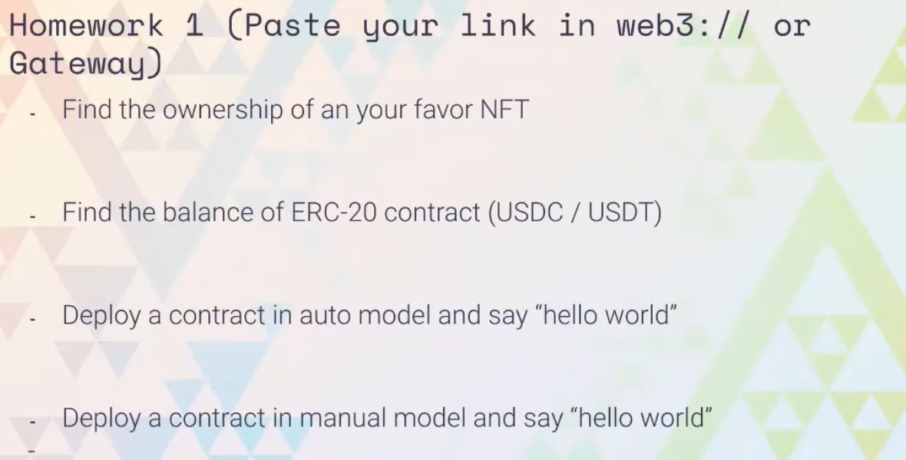

## Homework 1 (Paste your link in web3:// or Gateway)

- Find the ownership of an your favor NFT
- Find the balance of ERC-20 contract (USDC / USDT)
- Deploy a contract in auto model and say "hello world"
- Deploy a contract in manual model and say "hello"

---

## 作业提交方法：

**1. 访问  https://gist.github.com/**

**2. 上课完成后，根据具体的作业要求，在如下的 markdown 文本框中完成作业：**

> - 形式不做要求，你舒服的方式都可以，只要能 prove 你做出来就好啦
> - gist keep secret is fine, 因为 keep secret 可以保持作业无法被 search 到，并且持有 link 的人也可以读取里面的内容.

**3. 将该作业链接(复制 URL 地址即可)提交到 [Tally 表单](https://tally.so/r/3EWLqr)，完成作业提交**

Tally 链接: https://tally.so/r/3EWLqr

> 一共三次课 & 三次作业，为了方便审阅，建议统一都放在一个 gist 下面 ~
> 
> 作业截止时间：次周周一中午 12:00 ~

